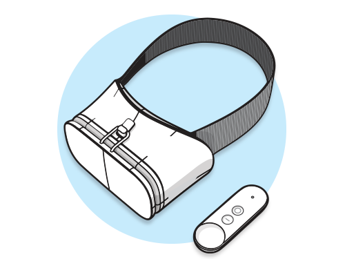

<!-- .slide: data-background="media/img/aframe.jpg" -->

  <h1>A-Frame</h1>
  
A web framework for building VR experiences

  

    David Ross | Mozilla Rep | **aframe.io**
  

<!-- NOTES -->
- Onboard web developers into the 3D and VR world with easy-to-use tools
- Prototype WebVR experiences faster

------

# Virtual Reality

<!-- .slide: data-background-video="media/video/virtualreality.mp4" data-background-video-loop="true" data-background-video-muted="true" data-state="state--bg-dark" -->

<!-- NOTES -->
- Ask how many have tried VR.
- Virtual reality is a technology platform that transports you to realistic, interactive, immersive 3D environments
- It's the next platform, will change how we work + play + communicate digitally, face of society

---

  

  

  

  

  

  

<!-- NOTES -->
- Backed by the largest corporations in the world, everyone wants in
- Range from cheap to expensive, tethered and untethered, controllers, tracking
- HTC Vive with Steam currently offers the most compelling experiences, but never know
- See a lot of different devices, systems, platforms competing against each other...

---

# WebVR

An open virtual reality platform with the advantages of **the Web**

  

    
    <i>Open</i>
  

  

    
    <i>Connected</i>
  

  

    
    <i>Instant</i>
  

<!-- NOTES -->
WebVR is...virtual reality in the browser, powered by the Internet

Open:
- Anyone can publish
- Open source culture with open standards

Connected:
- Traverse worlds

Instant:
- Click a link on Twitter or Weibo, immediate VR experiences
- No installs
- Imagine for long tail experiences: shopping & personal spaces
- Great for long tail bite-sized experiences

Transition:
- Web has advantages that make it the best platform for the people
- Need to act to make it reality, can't wait for VR to bake and crystallize
- Get involved

---

https://webvr.rocks

  

    
    <i>Firefox Quantum</i>
  

  

    
    <i>Microsoft Edge</i>
  

  

    
    <i>Chromium</i>
  

  

    
    <i>Chrome for Android</i>
  

  

    
    <i>Oculus Carmel</i>
  

  

    
    <i>Samsung Internet</i>
  

  

    
    <i>Mobile Polyfill</i>
  

<!-- NOTES -->
- Firefox + Chrome WebVR 1.0 hits release channels by early 2017
- Currently behind Nightly, custom builds, and flags
- Mobile Polyfill: use device motion / orientation sensors to polyfill on smartphones
- With all the browsers behind it...

---

# A-Frame

<!-- .slide: data-background="media/img/aframe-rendered-full.png" -->

A web framework for building virtual reality experiences

<!-- NOTES -->
- Launched last December
- Why:
  - Easy for web developers to create VR content, without graphics knowledge
  - Prototype and experiment WebVR and VR UX faster
  - Vehicle to kickstart WebVR ecosystem

---

## Hello Metaverse

<i>by Ada Rose Edwards (@lady_ada_king)</i>

<!-- .slide: data-background="media/img/metaverse.jpg" -->

<!-- NOTES -->
- A-Frame scene by Ada Rose Edwards running from inside my HTML slides
- Works on desktop, Android, iOS, Samsung Gear VR, Oculus Rift, HTC Vive
- Could open up the DOM Inspector to change values live
- Since it's just HTML...

---

# aframe.io

  

    
    <i>200+ contributors 6000+ Stargazers</i>
  

  

    
    <i>4000+ members on Slack</i>
  

  

    
    <i>100s of featured projects</i>
  

<!-- NOTES -->
- Open source and inclusive project
- Most work done on GitHub
- Active community on Slack to share projects, interact, hang out, seek help
- Featured projects on the `awesome-aframe` repository and *A Week of A-Frame* blog
